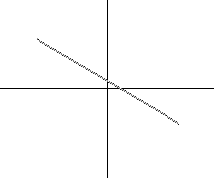

# Graphics Rendering in Assembly  

This repository contains **assembly implementations** for graphical rendering on two architectures:  
- **RISC-V**: Line drawing using the **Xiaolin-Wu algorithm** on a `.bmp` file.  
- **x86**: Rendering **Mandelbrot set**.  

---

## **Folder Structure**  

### **`RISC-V/` - Line Drawing with Xiaolin-Wu Algorithm**  
This folder contains an implementation of the **Xiaolin-Wu antialiased line-drawing algorithm** in **RISC-V assembly**. The program:  
- Draws an **anti-aliased line** on a **.bmp image**.  
- Uses **floating-point calculations** for smooth gradient transitions.  
- Modifies pixel brightness to create a visually appealing effect.  

#### **How to Run (RISC-V)**  
1. Assemble the code using a RISC-V assembler (e.g., GNU `riscv64-unknown-elf-as`).  
2. Execute the binary in a RISC-V emulator (such as QEMU).  
3. Open the generated `.bmp` file in an image viewer to see the result.  

### Example:
         In             --------->        Out
                   
         
                        --------->

---

### **`x86/` - Mandelbrot Set Rendering**  
This folder contains **x86 assembly implementations** for generating:  
- **Mandelbrot set** – A fractal visualization of complex numbers.  

The program:  
- efficiently combines x86 assembly with C programing
- Iterates over each pixel and applies fractal formulas to determine color intensity.  
- Uses **floating-point arithmetic** (FPU/SSE).  
- Outputs the result as a **bitmap image**.  

#### **How to Run (x86)**  
1. Assemble the code with `nasm` (Netwide Assembler):  
   ```sh
   nasm -f elf32 mandelbrot.asm -o mandelbrot.o

 
